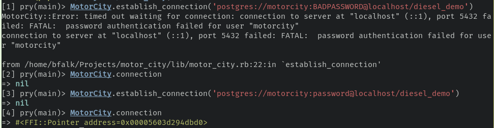
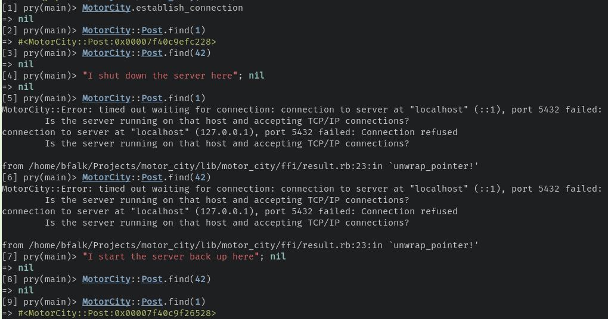

# MotorCity


> Project to demonstrate how to use the popular Rust ORM Diesel in Ruby.

## Requirements

 * Ruby 2.7.5+ or 3.1.1+
 * Rust 1.60.0+
 * Postgres 11+

## Getting Ready

1. Ensure the Diesel CLI is setup:

   ```bash
   cargo install diesel_cli --no-default-features --features postgres
   ```

2. Modify or ensure credentials in `.env` has access to create a database

3. Create database and structure:

   ```bash
   diesel database setup
   ```

4. Install gem dependencies

   ```bash
   bundle install
   ```
5. Make sure the gem builds and everything passes:

   ```bash
   bundle exec rake
   ```

## Comparison to ActiveRecord

```
time ./bin/stress_test_motor > /dev/null

real    0m1.581s
user    0m1.168s
sys     0m2.307s
```

```
time ./bin/stress_test_activerecord > /dev/null

real    0m4.152s
user    0m3.004s
sys     0m1.797s
```

## Surfacing Errors from Rust



<hr />


